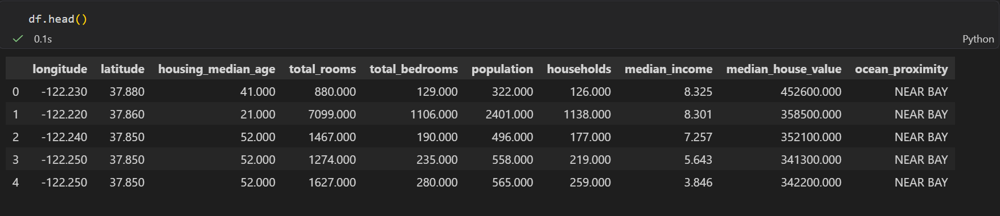
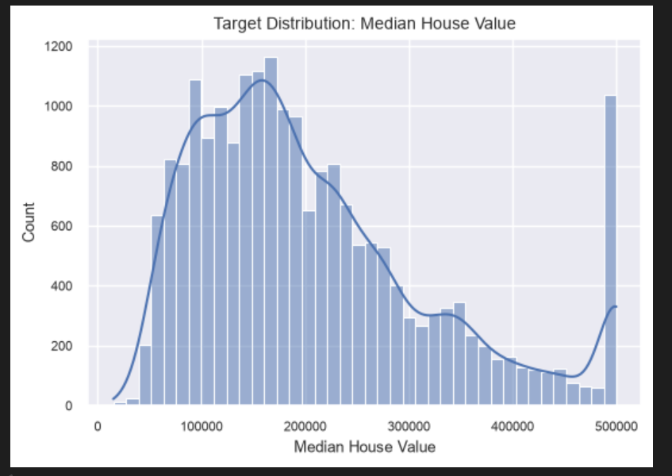
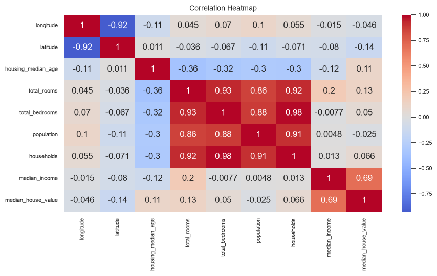
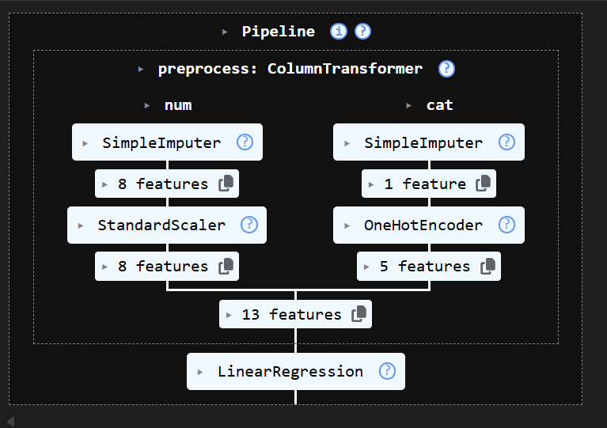
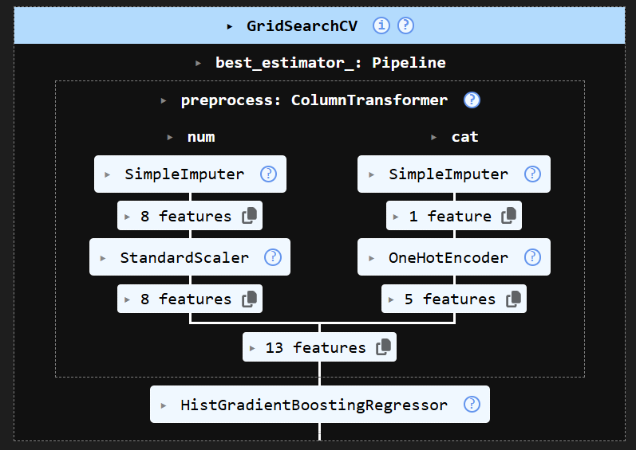
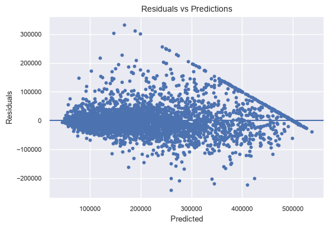
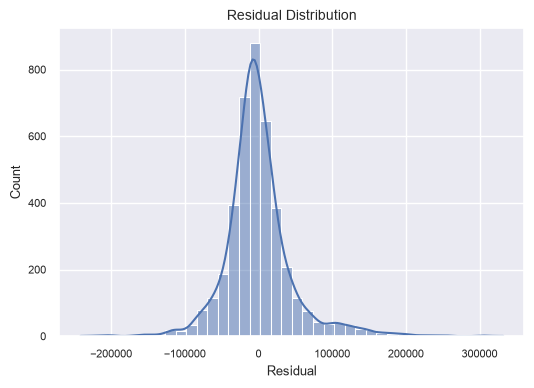

# House Price Prediction using Machine Learning

## Overview

This project predicts house prices using machine learning techniques. The workflow includes data preprocessing, exploratory data analysis (EDA), feature engineering, model training, hyperparameter tuning, and model evaluation.

## Technologies Used

* Python
* Pandas
* NumPy
* Scikit-learn
* Matplotlib
* Seaborn

## Workflow

1. Data Cleaning and Preprocessing
2. Exploratory Data Analysis (EDA)
3. Feature Engineering
4. Machine Learning Pipeline Creation
5. Hyperparameter Tuning using GridSearchCV
6. Model Evaluation and Residual Analysis

## Dataset Preview

## Target Variable Distribution

## Correlation Analysis

## Machine Learning Pipeline

## Hyperparameter Tuning

## Residual Analysis

## Future Improvements

* Deploy using Streamlit
* Experiment with XGBoost and LightGBM
* Advanced feature engineering
* Model explainability using SHAP
